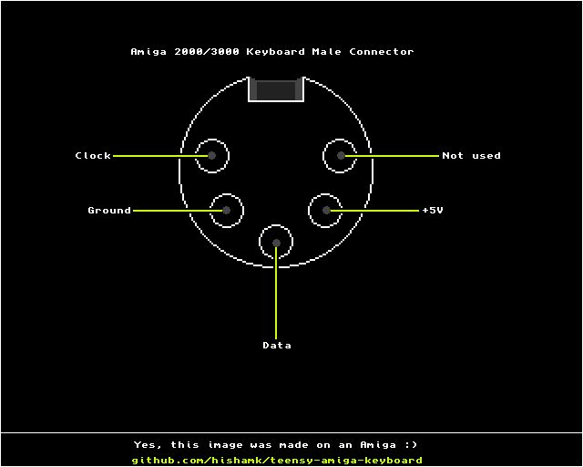
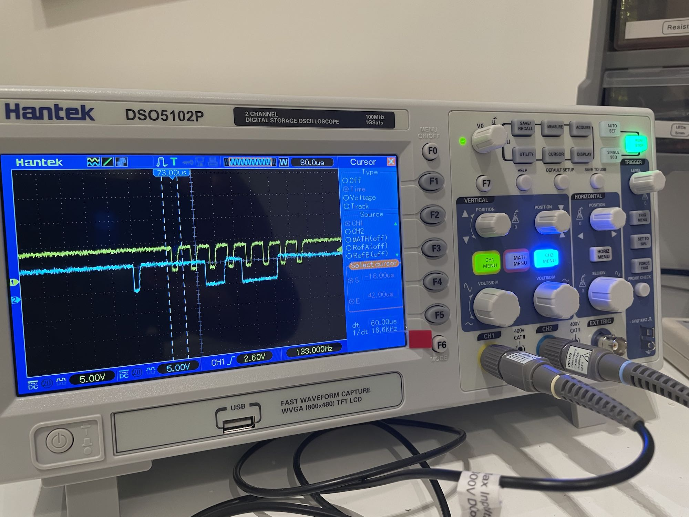

# teensy-amiga-keyboard
Allows modern computers to use Amiga keyboards as regular USB keyboards.

Tested with the following Amiga keyboards:

- Amiga 3000 model KKQ-E94YC
- Amiga CDTV KKQ-E96YC

I have not yet tested it with an Amiga 2000 keyboard, though there is no reason why it shouldn't work as it shares the same connector pinout as the 3000.

I've used a Teensy 2.0, but any Teensy with an ATmega32U4 or similar MCU with native USB should work. To program it, you can use Teensyduino.
I'd suggest using a DIN 5 to PS/2 adapter to connect the keyboard to the Teensy. Cut off the PS/2 connector, check continuity between the exposed wires and the female DIN 5 end to figure out which wire is which, then connect as follows:

## Keyboard -> Teensy
- Ground + shield wire -> Ground
- 5V -> 5V
- Clock -> F6
- Data -> F7

## A peek at the signals

As can be seen, both clock (yellow) and data (blue) signals are active low - that is, they're 5V in their 0 state and 0V in their 1 state. The initial pulse in the data signal is the handshake from the Teensy. The byte that follows is made of seven bits for the key code and an eighth bit for the key press/key release flag.
